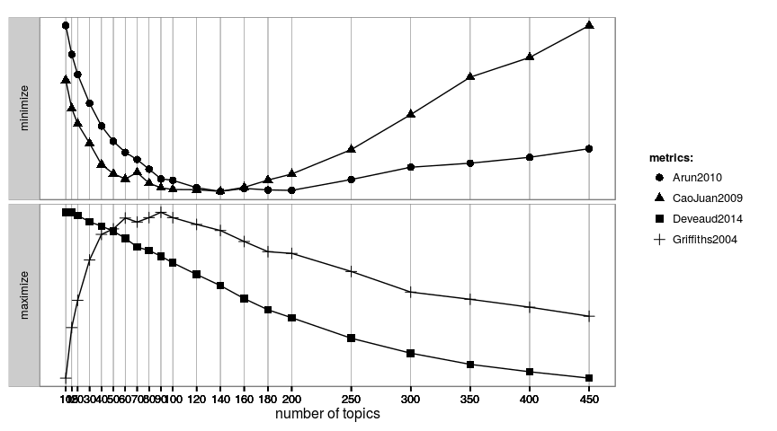

<!-- README.md is generated from README.Rmd. Please edit that file -->
This package use some metrics to find optimal number of topics for Latent Dirichlet allocation (LDA) models.

For more complete explanation see [vignette](http://example.com).
