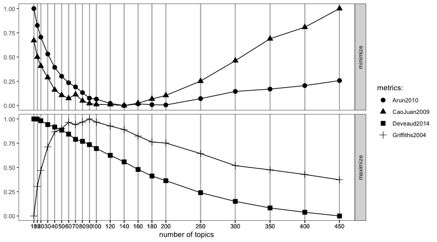

<!-- README.md is generated from README.Rmd. Please edit that file -->

This package uses some metrics to find optimal number of topics for
Latent Dirichlet allocation (LDA) models.

For more complete explanation see
[vignette](http://rpubs.com/siri/ldatuning).
