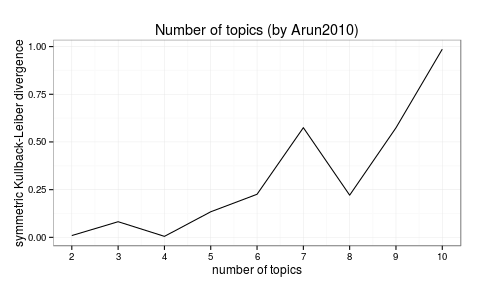

```{r, echo = FALSE}
knitr::opts_chunk$set(collapse = TRUE, comment = "#>")
```

Package `ldatuning` realise two function to select appropriate number of topics for LDA model.

```{r, message = FALSE}
library("ldatuning")
```

Next examples use "AssociatedPress" dataset from the `topicmodels` package.

```{r, message = FALSE}
library("topicmodels")
data("AssociatedPress", package="topicmodels")
dtm <- AssociatedPress[1:10, ]
```

## Harmonic means

The first idea was proposed by Griffiths2004 and base on counting of harmonic likelihood for the series of LDA models and selection of the one with the highest value (harmonic means are always negative numbers).

```{r, fig.width = 5, eval = FALSE}
metrics <- griffiths2004(dtm, topics = 2:10, mc.cores = 2L)
griffiths2004plot(metrics)
```


Later xxx2009 showed that this metric is not stable on real data...

## Symmetric Kullback-Leiber divergence

Arun2010 proposed metric, which should decrease close to optimal number of topics and rise again after this interval. Though, all effort to repeat his experiment (e.g. ) leads to monotone increasing metric with local minimums.

```{r, fig.width = 5, eval = FALSE}
metrics <- arun2010(dtm, topics = 2:10, mc.cores = 2L)
arun2010plot(metrics)
```



Also, there should be secondary dips, corresponding to the optimal number of topics multiplied to integral number, i.e. splitting of optimal topics into 2, 3 or more parts. The last plot can be interpreted as 4 optimal topics and 8 quasi-optimal. Of course, this small corpus is just an example and analyse is insignificant.


## Vignette Info

Note the various macros within the `vignette` section of the metadata block above. These are required in order to instruct R how to build the vignette. Note that you should change the `title` field and the `\VignetteIndexEntry` to match the title of your vignette.

## Styles

The `html_vignette` template includes a basic CSS theme. To override this theme you can specify your own CSS in the document metadata as follows:

    output: 
      rmarkdown::html_vignette:
        css: mystyles.css

## Figures

The figure sizes have been customised so that you can easily put two images side-by-side. 

```{r, fig.show='hold'}
plot(1:10)
plot(10:1)
```

You can enable figure captions by `fig_caption: yes` in YAML:

    output:
      rmarkdown::html_vignette:
        fig_caption: yes

Then you can use the chunk option `fig.cap = "Your figure caption."` in **knitr**.

## More Examples

You can write math expressions, e.g. $Y = X\beta + \epsilon$, footnotes^[A footnote here.], and tables, e.g. using `knitr::kable()`.

```{r, echo=FALSE, results='asis'}
knitr::kable(head(mtcars, 10))
```

Also a quote using `>`:

> "He who gives up [code] safety for [code] speed deserves neither."
([via](https://twitter.com/hadleywickham/status/504368538874703872))
